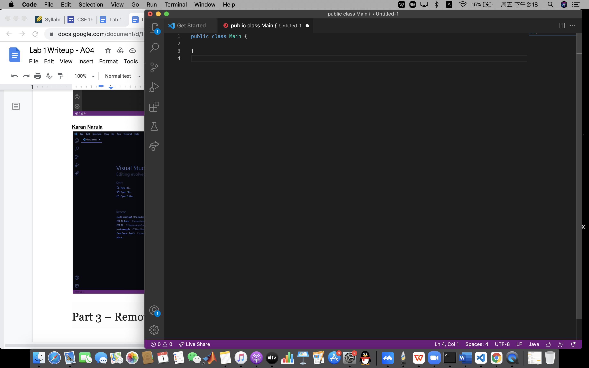
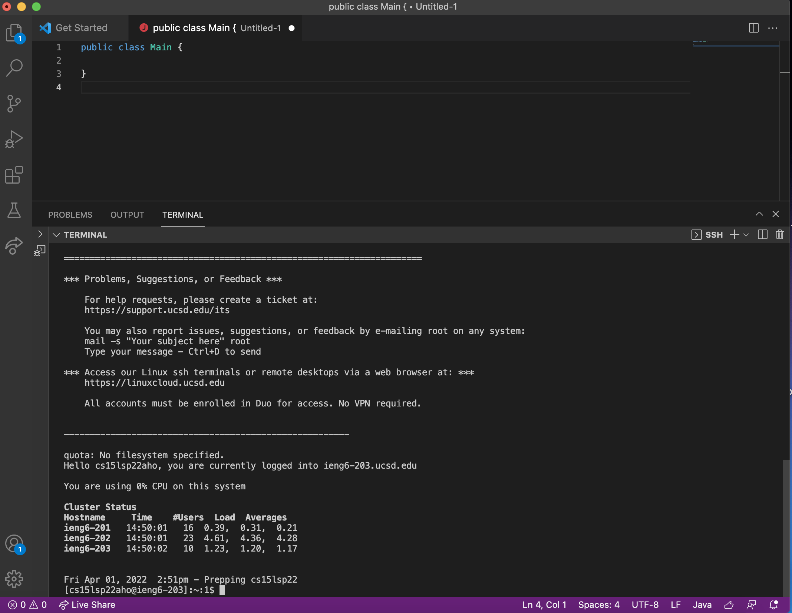
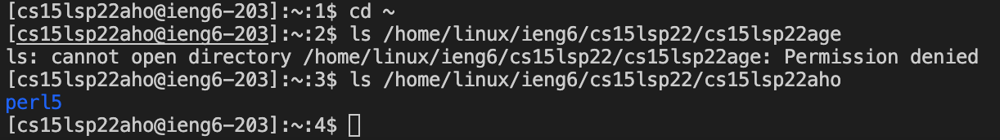
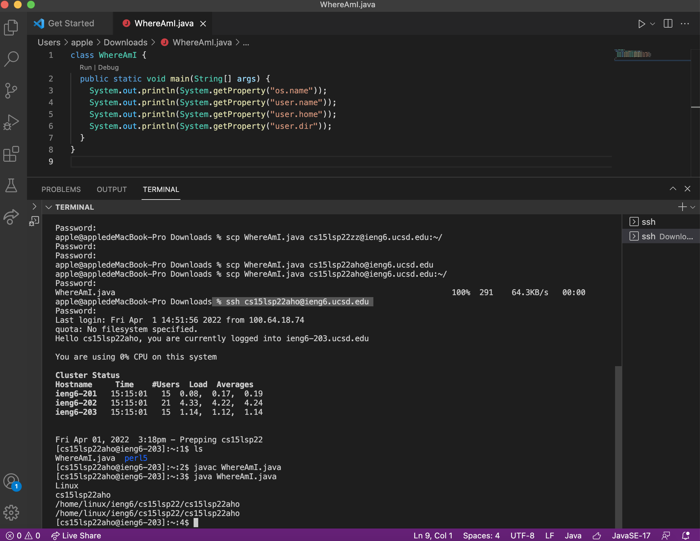
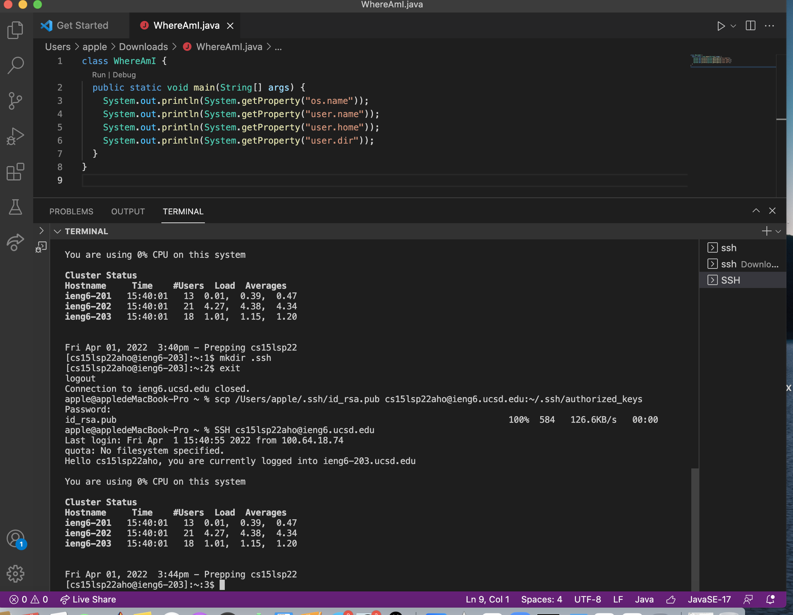
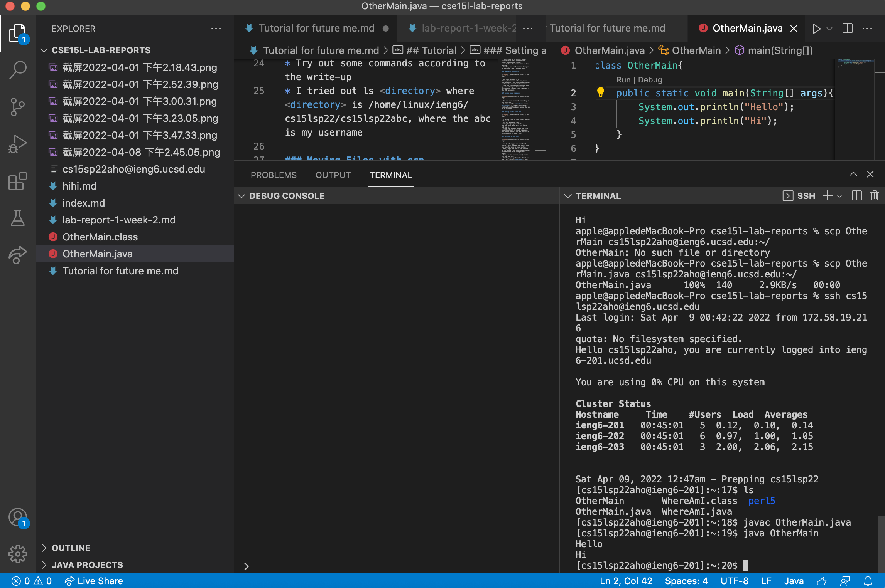

## Tutorial

### Installing VScode

* First, you go to https://code.visualstudio.com/, and download visual studio code there. 
* and follow the instruction on the website. 
* Finally, you will be able to open up a window like I showed above. 

### Remotely Connecting

* Get your account from 
https://sdacs.ucsd.edu/~icc/index.php, and use $ ssh cs15lsp22zz@ieng6.ucsd.edu to connect to the server
* Type yes to the question that pops up, and enter your tritonlink password to connect to a computer in the CSE basement. 

### Trying some commands

* Try out some commands according to the write-up
* I tried out ls <directory> where <directory> is /home/linux/ieng6/cs15lsp22/cs15lsp22abc, where the abc is my username

### Moving Files with scp

* create a file on your local laptop, and run it.
* use scp WhereAmI.java cs15lsp22zz@ieng6.ucsd.edu:~/
and log into ieng6 with ssh again, and use ls
* Since scp already moved the file from the client to ieng6 computer, you should be able to see that file once you use ls under ssh. 

### Setting an SSH Key

* run $ ssh-keygen on your local laptop. This creates one public and one private keys on your system.
* Next, copy the public key to the server using $ ssh cs15lsp22zz@ieng6.ucsd.edu and enter the password again. 
* Then, on the server, use $ mkdir .ssh and log out. 
* Finally, you go back to client and use $ scp /Users/<user-name>/.ssh/id_rsa.pub cs15lsp22zz@ieng6.ucsd.edu:~/.ssh/authorized_keys, where you replace those with your own username and the path. 

### Optimizing Remote Running

* There are more than one way to optimize this remote running. First, I made OtherMain.java instead of editing WhereAmI.java directly. 
