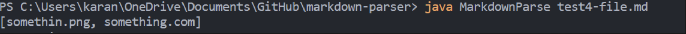
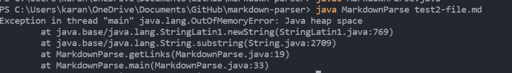
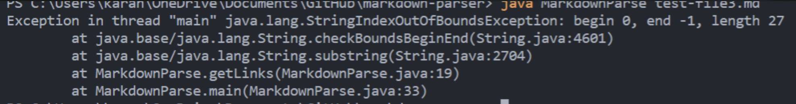

## Lab Report 2

### First Code Change

* Link to failing test file: [https://github.com/zzxxuu/markdown-parser/blob/main/test-file4.md](https://github.com/zzxxuu/markdown-parser/blob/main/test-file4.md)

* The problem here is that it is supposed to return just the URL links, but it is returning both the image and URL links.  The bug is that the code does not differentiate between image and URL links. What me and my partner did here is allow the code to identify "!" to differentiate between image and URL and only return URL.
The failure-inducing file containd both of these, which is why we have the output shown above.  

### Second Code Change

* Link to the failing test file: [https://github.com/zzxxuu/markdown-parser/blob/main/test-file2.md](https://github.com/zzxxuu/markdown-parser/blob/main/test-file2.md)

* The problem here is that the code never reaches the end of the infinite while loop, causing the error of heap space. Therefore, all of the elements in the test file would be go over and the code will never stop. Therefore, our group made this if statement to break the loop if it reaches the end of it. 

### Third Code Change

* Link to the failing test file: [https://github.com/zzxxuu/markdown-parser/blob/main/test-file3.md](https://github.com/zzxxuu/markdown-parser/blob/main/test-file3.md)

*  The correction of the code is for when the test files contain parentheses but no link. This was the case for test file 3, it only has couple sentences and []. The code failed initially for it skips this situation where [] being used incorrectly, which results in indexoutbounds for the code would not stop even if the input does not contain the required parenthese. 