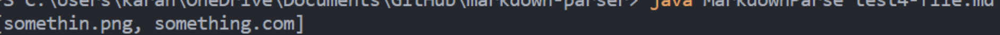

## Lab Report 2

### First Code Change

* Link to failing test file: [https://github.com/zzxxuu/markdown-parser/blob/main/test-file4.md]https://github.com/zzxxuu/markdown-parser/blob/main/test-file4.md

* The problem here is that it is supposed to return more than just the URL links. However, the bug here only returned the links as I showed above. 

### Second Code Change

* Link to the failing test file: [https://github.com/zzxxuu/markdown-parser/blob/main/test-file2.md]https://github.com/zzxxuu/markdown-parser/blob/main/test-file2.md

* The problem here is that the code never reaches the end of the infinite while loop, causing the error of heap space. Therefore, our group made this if statement to break the loop if it reaches the end of it. 

### Third Code Change

* Link to the failing test file: [https://github.com/zzxxuu/markdown-parser/blob/main/test-file3.md]https://github.com/zzxxuu/markdown-parser/blob/main/test-file3.md

* The bug here is that the index is out of bounds. There should no be -1 index in our file. 