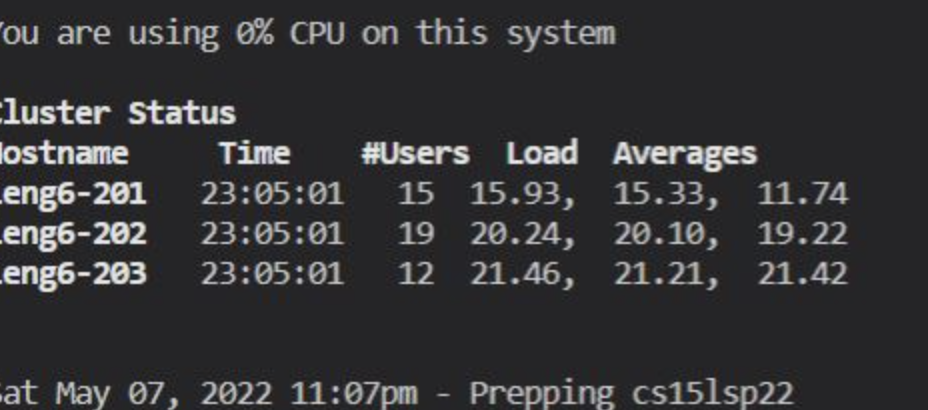

## Lab Report 3

### Streamlining ssh Configuration

I edited the file by entering the host and hostname. 

ieng6, as my alia, loged me in my account without using my username and password. 

I was able to use scp to move the file to the remote computer using the alia. 

### Setup Github Access from ieng6

The key was stored in my user account. 

The private key is in the remote computer with ssh directry. As I shown here with `ls` command, you can tell becauae it is listed under there. 

I used `vim` to change the `testfile`. To perform the follwing operations, `git add test-file.md` and `git commit` were used. 

