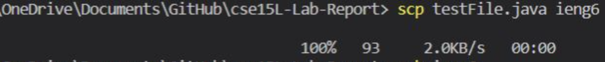
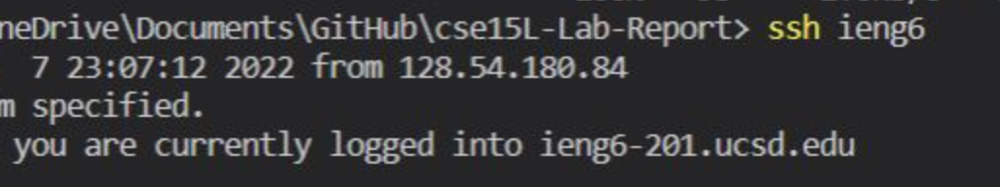
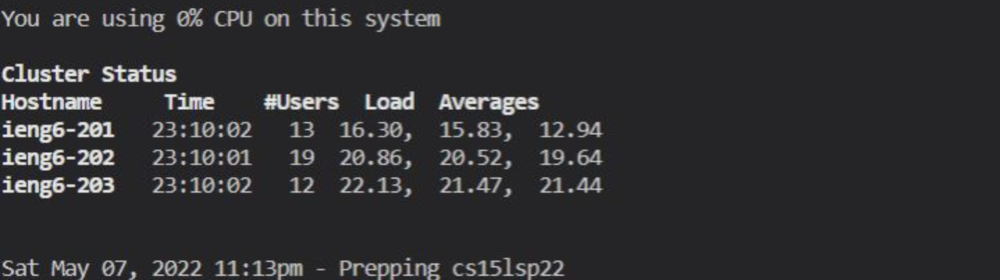
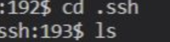
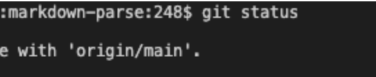
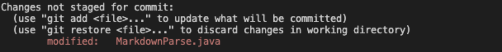
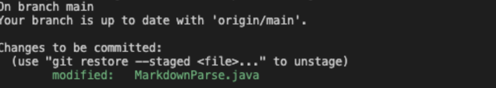
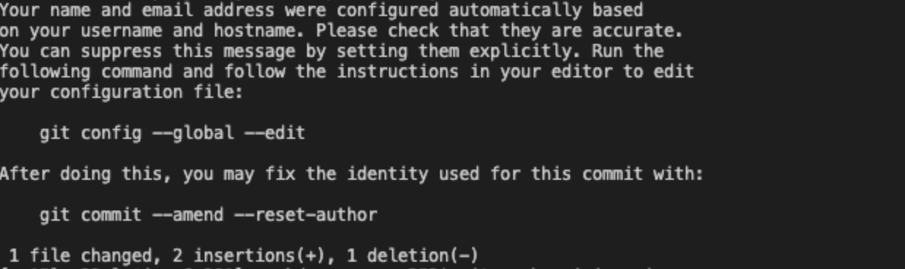
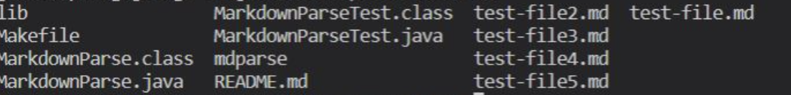
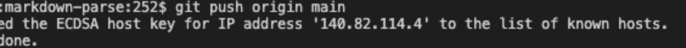

## Lab Report 3

### Streamlining ssh Configuration

I edited the file by entering the host and hostname. 

ieng6, as my alia, loged me in my account without using my username and password. 

I was able to use scp to move the file to the remote computer using the alia. 

### Setup Github Access from ieng6

The key was stored in my user account. 

The private key is in the remote computer with ssh directry. As I shown here with `ls` command, you can tell becauae it is listed under there. 

Above are showing using the `git` command to commit and push a change while logging into my ieng6 account

I used `vim` to change the `testfile`. To perform the follwing operations, `git add test-file.md` and `git commit` were used. 

### Copy Whole directories with scp -r

Above are the process of coping `markdown-parser` to the remote computer. You can see that all of the required files are there when I use `ls` command. 

After logging into my `ieng6` account, I was able to compile and run within remote computer. And I used the Linux/Max commands since the terminal computer is that category.

So, I used this command to copy the directory and run the test in one line:  `scp -r . ieng6:markdown-parse2; ssh ieng6 "cd markdown-parse2; /software/CSE/oracle-java-17/jdk-17.0.1/bin/javac -cp .:lib/junit-4.13.2.jar:lib/hamcrest-core-1.3.jar MarkdownParseTest.java; /software/CSE/oracle-java-17/jdk-17.0.1/bin/java -cp .:lib/junit-4.13.2.jar:lib/hamcrest-core-1.3.jar org.junit.runner.JUnitCore MarkdownParseTest"`