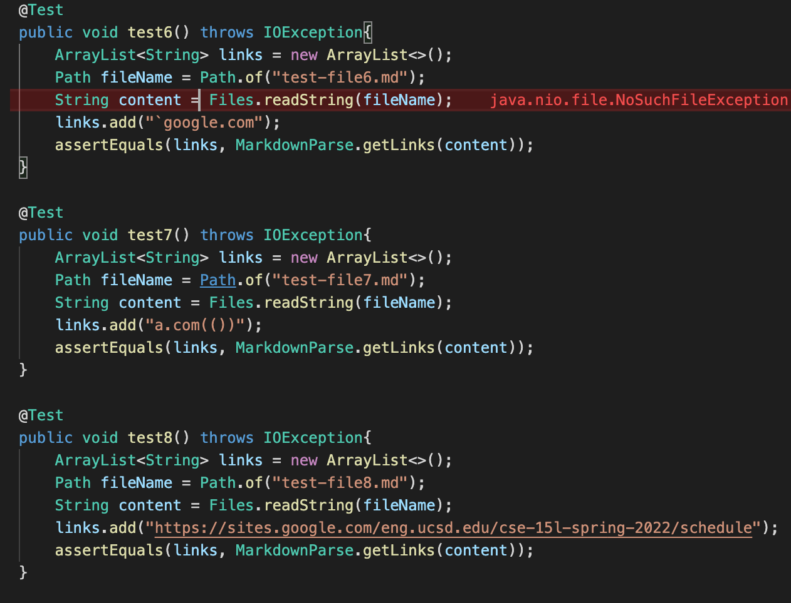
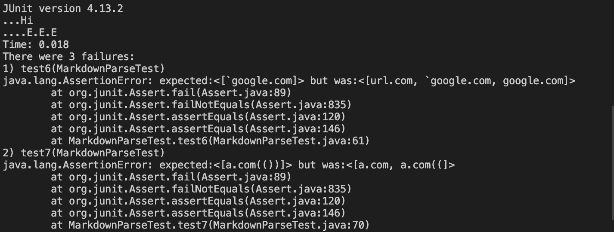
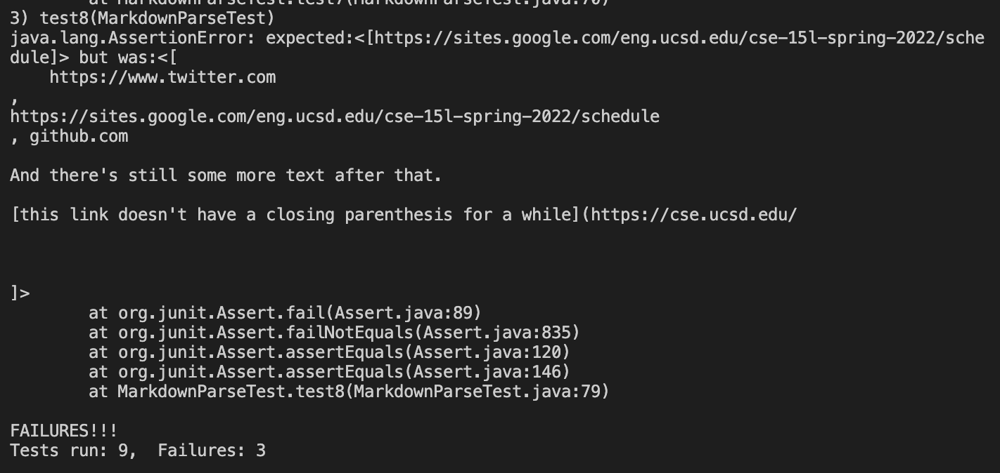
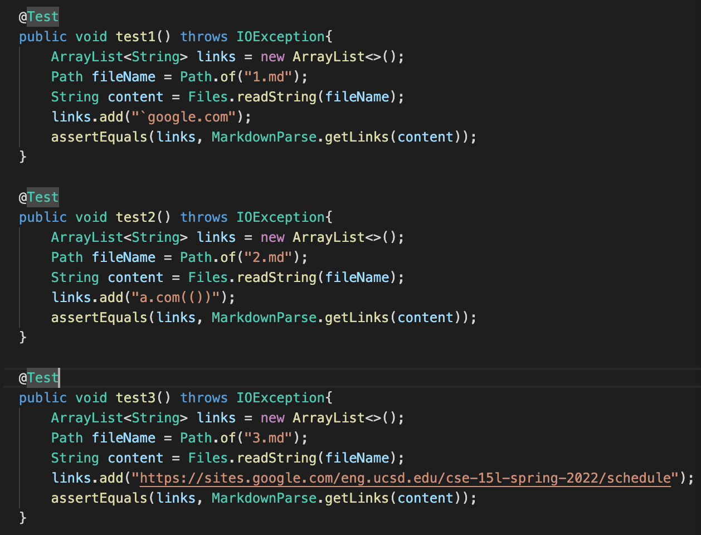
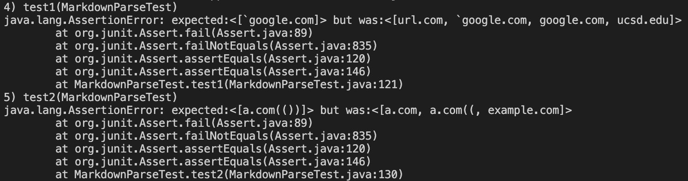
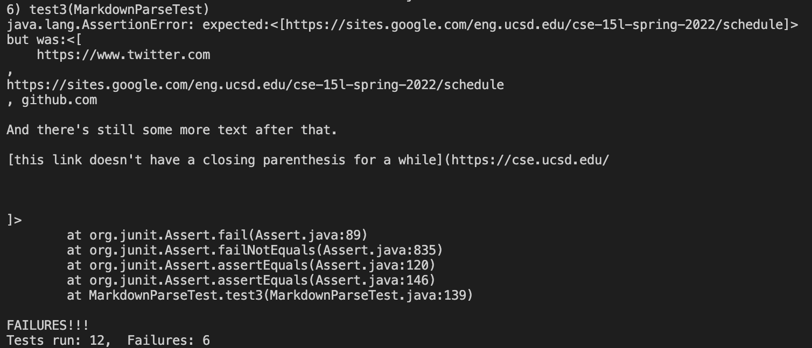

## Lab Report 4

### my repository 

* link
[https://github.com/zzxxuu/mardown-parser](https://github.com/zzxxuu/mardown-parser)

* Tests:

* Output

### The other group's repository

* Link
[https://github.com/henrigy/markdown-parser/blob/main/MarkdownParse.java](https://github.com/henrigy/markdown-parser/blob/main/MarkdownParse.java)

* Tests

* Output

### Answering the Question

* For snippet one, my code failed mainly because it does not have ability to handle when the incline text have backstick. Therefore, I could add an if/else statement inside the while loop to deal with situation. When it encounters the backstick, it should knows that it is not a link. 

* For snippet two, my code did not print out the website link like it supposed to mainly because the nested brakcet. Therefore, a code change of adding if statement under the while loop could solve this problem. If there is a "[" and if there is still another "[" after it, check if there are two "]" after them to decide to print out the link or not. 

* For snippet three, the code is not supposed to print out the link if there are new lines in brackets and paraenthess. So add if statement that determines if there are new spaces after the line indicating a start of a new line inside of the brackets or paraenthess, stop and not print out the link. 