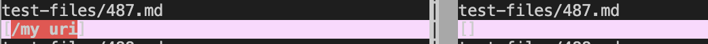
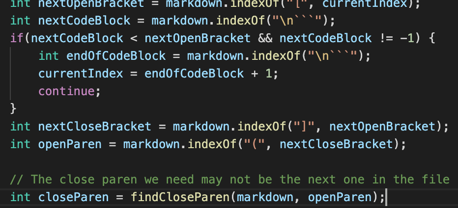
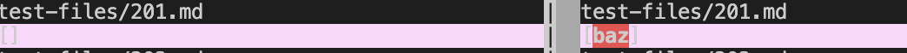
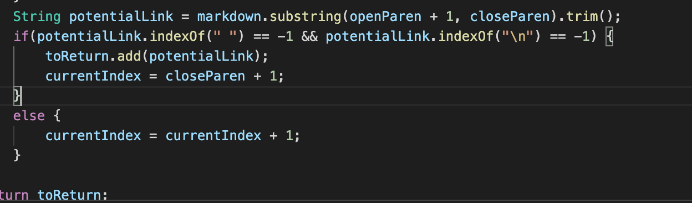

## Lab Report 5

### First Test case

* How to find the difference:
;
* I used `bash script.sh > results.txt` command for both my directory and the class given one. And use `vimdiff` to check the different results for the tests. 

* [link for the test file in the given repository](https://github.com/nidhidhamnani/markdown-parser/edit/main/test-files/487.html.test)

* The class's implementation is wrong while mine is correct

* The actual output is as in the screenshot above shown, and the expcted output is [/my uri]. 

* The problem with class's implementation is that it return a empty link when [/my uri] is supposed to return. To be more specfic, the code returns the empty "toRetrun" while it should not enter the if statement. The code should refine its methods of finding the index of the representative symbols. Therefore, the code should be changed is the following part:
. 

### Second Test case
* How to find the difference:

* I used `bash script.sh > results.txt` command for both my directory and the class given one. And use `vimdiff` to check the different results for the tests. 

* [link for the test file in the given repository](https://github.com/nidhidhamnani/markdown-parser/blob/main/test-files/201.html.test)

* the actual output is in the screenshot above shown, and the expected output is [], where no link will be get. 

* The class's implementation is wrong while mine is correct

* The problem with the given implementation is that it ignores situation where if there is something inserted between the link name and the link itself. In this example, there is ": <bar>" exist between the "]" and "(". Therefore, it should build more statement to deal with the situation, the part that shoul get changed is here:
.

